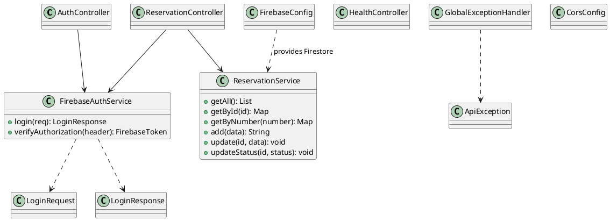

# Class Diagram

```plantuml
@startuml
class AuthController
class ReservationController
class HealthController

class FirebaseAuthService {
  +login(req): LoginResponse
  +verifyAuthorization(header): FirebaseToken
}

class ReservationService {
  +getAll(): List
  +getById(id): Map
  +getByNumber(number): Map
  +add(data): String
  +update(id, data): void
  +updateStatus(id, status): void
}

class LoginRequest
class LoginResponse
class ApiException
class GlobalExceptionHandler
class FirebaseConfig
class CorsConfig

AuthController --> FirebaseAuthService
ReservationController --> FirebaseAuthService
ReservationController --> ReservationService

FirebaseConfig ..> ReservationService : provides Firestore
GlobalExceptionHandler ..> ApiException
FirebaseAuthService ..> LoginRequest
FirebaseAuthService ..> LoginResponse
@enduml
```
