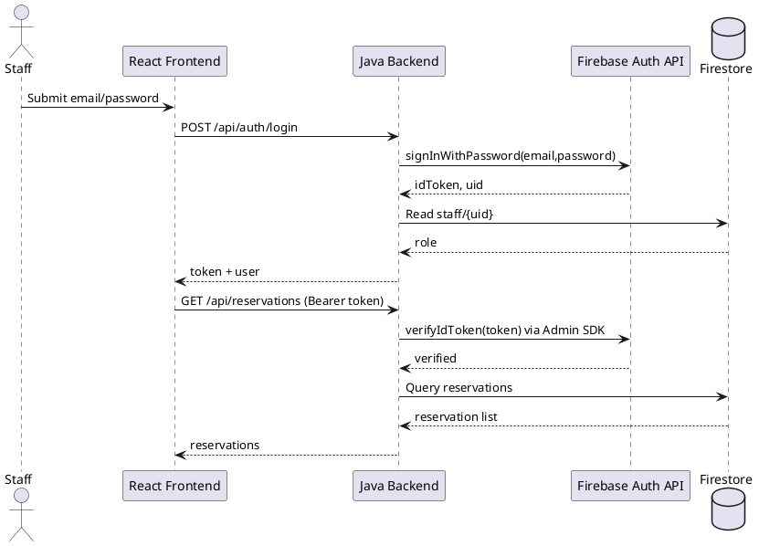

# Sequence Diagram

## Login + Load Reservations

```plantuml
@startuml
actor Staff
participant "React Frontend" as FE
participant "Java Backend" as BE
participant "Firebase Auth API" as FA
database "Firestore" as DB

Staff -> FE : Submit email/password
FE -> BE : POST /api/auth/login
BE -> FA : signInWithPassword(email,password)
FA --> BE : idToken, uid
BE -> DB : Read staff/{uid}
DB --> BE : role
BE --> FE : token + user
FE -> BE : GET /api/reservations (Bearer token)
BE -> FA : verifyIdToken(token) via Admin SDK
FA --> BE : verified
BE -> DB : Query reservations
DB --> BE : reservation list
BE --> FE : reservations
@enduml
```
