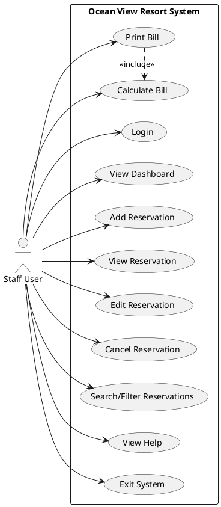

# Use Case Diagram

```plantuml
@startuml
left to right direction
actor "Staff User" as Staff
rectangle "Ocean View Resort System" {
  usecase "Login" as UC1
  usecase "View Dashboard" as UC2
  usecase "Add Reservation" as UC3
  usecase "View Reservation" as UC4
  usecase "Edit Reservation" as UC5
  usecase "Cancel Reservation" as UC6
  usecase "Search/Filter Reservations" as UC7
  usecase "Calculate Bill" as UC8
  usecase "Print Bill" as UC9
  usecase "View Help" as UC10
  usecase "Exit System" as UC11
}

Staff --> UC1
Staff --> UC2
Staff --> UC3
Staff --> UC4
Staff --> UC5
Staff --> UC6
Staff --> UC7
Staff --> UC8
Staff --> UC9
Staff --> UC10
Staff --> UC11

UC9 .> UC8 : <<include>>
@enduml
```
